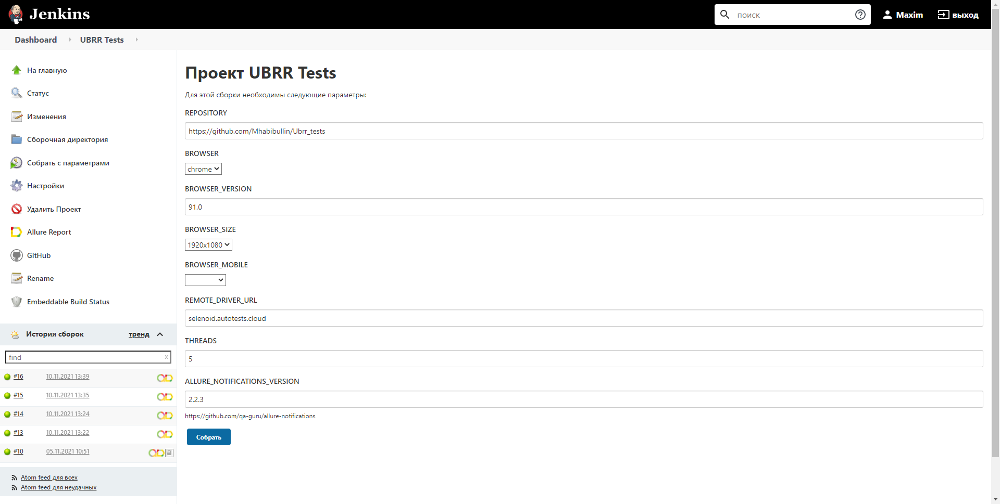
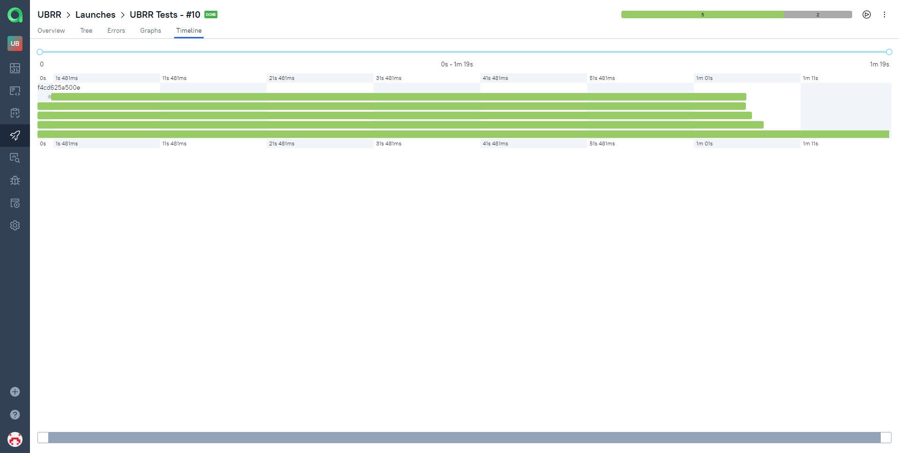
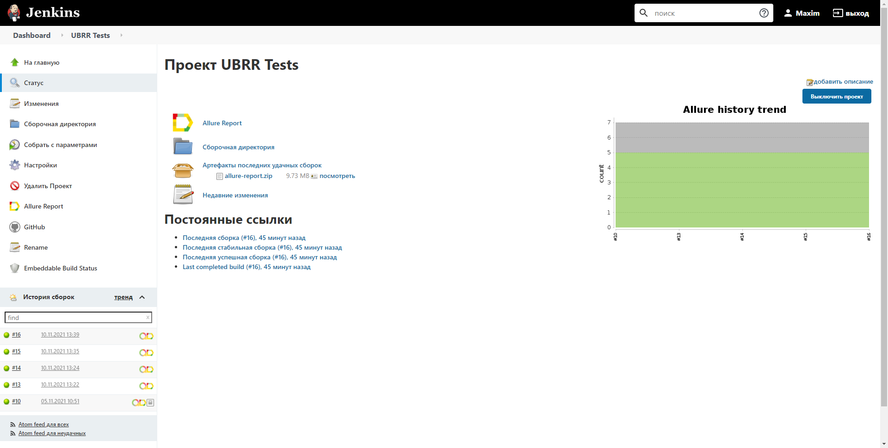
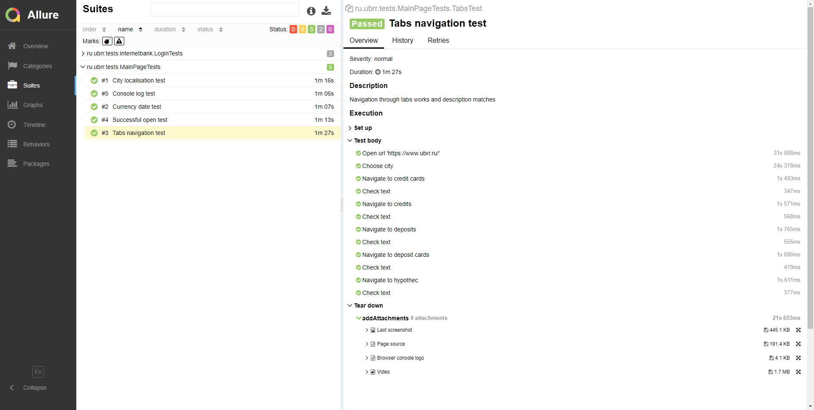
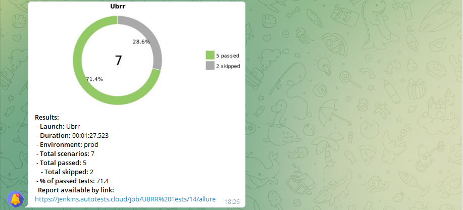
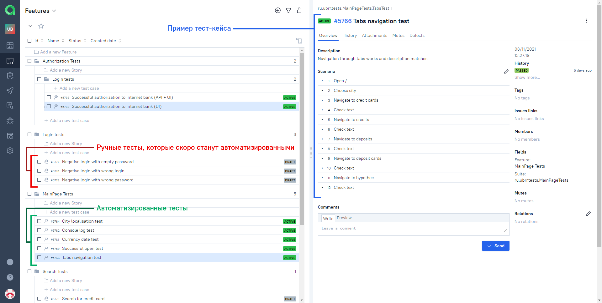
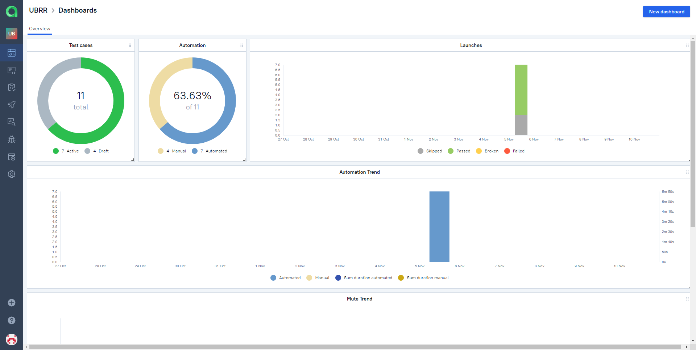
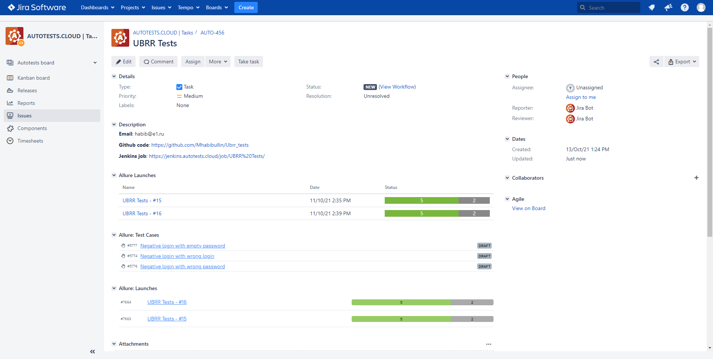

# Autotests for [**ubrr.ru**](https://www.ubrr.ru/)


## Stack:
| Java | Gradle | Junit5 | Selenide | Jenkins | Selenoid | Allure Reports | Allure TestOps | Telegram | Jira |
|:----:|:------:|:------:|:--------:|:-------:|:--------:|:--------------:|:--------------:|:--------:|:----:|
|  |  |  |  |  |  |  |  |  |  |

## Tests launch

### How to run tests from the command line
Run tests with default parameters:
```bash
gradle clean test
```

### Generate Allure report:
```bash
allure serve build/allure-results
```

### Running tests from Jenkins:

1. Open link to [project](https://jenkins.autotests.cloud/job/UBRR%20Tests/build?delay=0sec)
2. Select "Collect with parameters"
3. Specify parameters or leave the default parameters, click "Collect"

   

### Parameterization features added to the build:

* browser type
* browser version
* browser window size
* mobile version of the site (Android, IOS)
* remote server address
* remote video storage address
* number of startup threads

## Tests run in Selenoid


##  Tests run in 5 threads



## Allure Report is used to build the report

An example of a general test report:



An example of a detailed report (with attached screenshots, logs, videos):




## Results notifications are sent by the chatbot to Telegram:



## Tests are integrated into the Allure TestOps test management system

An example of manual and automated tests in Allure TestOps:



Dashboards:




## Tests are integrated into the Jira task tracking system




## Contact me

:rocket: [**Telegram - @Avadhutabrahman**](https://t.me/avadhutabrahman)
